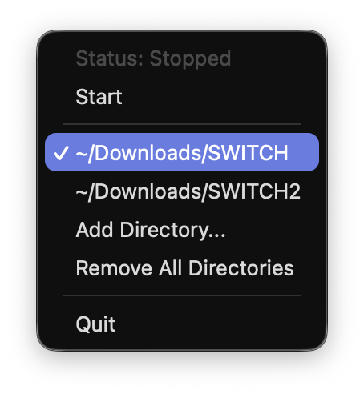

# dbibackend

PC-side server for installing games into Nintendo Switch via USB (DBI0 protocol).

Fork of [lunixoid/dbibackend](https://github.com/lunixoid/dbibackend), rewritten in Go.

## Features

- System tray menu bar app (default) with start/stop control
- CLI mode for headless usage (`--cli`)
- Multiple directory support — scan all your title folders at once
- Cross-platform: macOS, Linux, Windows
- NFC-normalized filenames (fixes Korean/Unicode display on Switch)
- Single binary — no Python or runtime dependencies
- GoReleaser + Homebrew tap distribution

## Requirements

Host:
- [libusb](https://libusb.info/)

Nintendo Switch:
- [DBI](https://github.com/rashevskyv/dbi) v202+

## Install

### Homebrew (macOS)

```bash
brew install kyungw00k/cli/dbibackend
```

### Download

Download the latest binary from [Releases](https://github.com/kyungw00k/dbibackend/releases).

## Usage

### Menu bar mode (default)

```bash
dbibackend [--debug]
```

The app lives in your system tray. Click the DBI icon to:

1. **Start** — begin waiting for a Switch USB connection
2. **Add Directory** — add folders containing NSP/NSZ/XCI files
3. **Stop** — disconnect and stop the server
4. On Switch, open DBI → Install title from USB
5. Select and install titles from all configured directories



### CLI mode

```bash
dbibackend --cli <titles_dir> [--debug]
```

## Build from source

```bash
go build -o dbibackend ./cmd/dbibackend
```

## License

MIT
